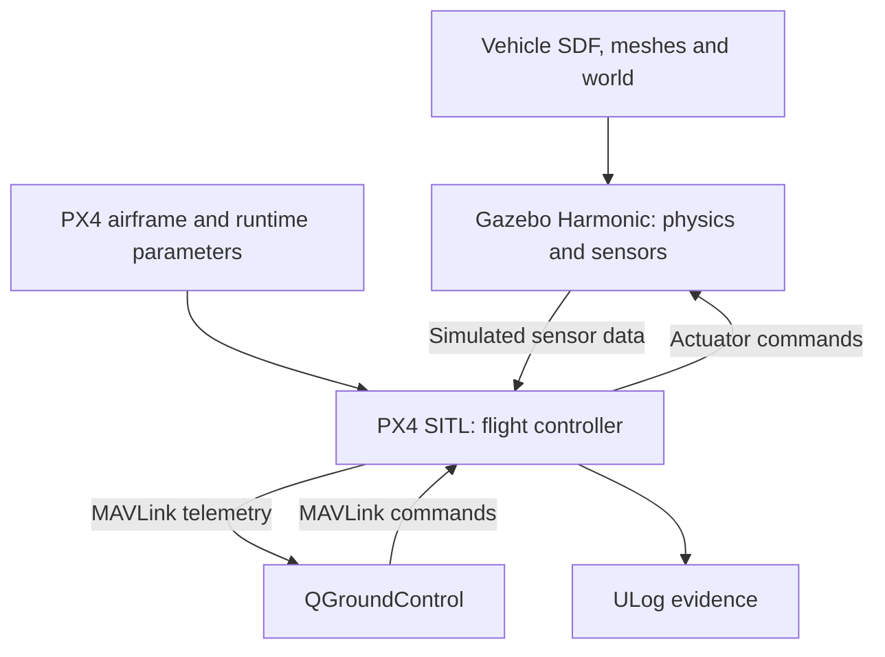

# Simulation environment and faculty questions 1–3

Updated October 2, 2026. Status: reference simulation documented; complete reproducibility capture still open.

## 1. Are we using Gazebo and SITL?

Yes. SITL means **software-in-the-loop**: the PX4 autopilot executes on the Linux workstation and exchanges simulated sensor and actuator data with Gazebo. QGroundControl provides the operator interface. This work exercises a reference vehicle; it does not yet simulate or validate the proposed DronePi aircraft, payload, electrical system or endurance.

The October 1 screenshot shows `x500_0` in the `default` world, with QGroundControl reporting Flying/Hold. The two archived ULogs identify PX4 commit `d6f12ad1c4f70ad3230afd7d86e971421e02fef4`, `SYS_AUTOSTART=4001`, and `MAV_TYPE=2`. The screenshot and logs are complementary evidence; an exact screenshot-to-log timestamp match has not been established.

## 2. Architecture, software and configuration

The diagram describes the PX4/Gazebo reference arrangement. ROS 2, MAVROS, Point-LIO and the DronePi mission application are not claimed as integrated into these runs. Ports and launch environment overrides have not yet been captured.

| Component | Recorded version or state | Evidence / limit |
|---|---|---|
| Workstation OS | Ubuntu 24.04.5 LTS, amd64-class Intel workstation | User terminal output October 2 |
| Python | 3.12.3 | User terminal output |
| GPU | NVIDIA RTX 5080, 16 GB class | October 1 nvidia-smi; driver 595.91.07 reported |
| PX4 | v1.17.0; commit d6f12ad1c4f70ad3230afd7d86e971421e02fef4 | User Git output and both ULogs |
| Gazebo | Native Harmonic, gz-sim 8.15.0 | User gz version output; distinct from installed Citadel Snap |
| QGroundControl | x86_64 AppImage; exact version and checksum pending | Startup screenshot; connected reference simulation screenshot |
| Vehicle / world | x500_0 / default | October 1 screenshot |
| ROS / colcon / conda | Not found on current PATH; no setup files found in searched locations | October 2 terminal check; not proof of absence everywhere |
| FreeCAD | Mechanical 0.22.0dev.34125, Snap 228 | CAD support tool, outside simulation control loop |
| DronePi code | Baseline 57d720586f81b035187e65cb0358b1f58233b36e; local repair c4813fa432162516f0fc36fc97caf44839198096 | 12 isolated regression checks pass; no full integration validation |

### Available evidence

- [Reference simulation screenshot](SITL_X500_2026-10-01.png).
- [Archived flight logs](iterations/2026-09-27/flight-logs/).
- [Initial parameter snapshots extracted from both logs](SITL_Parameters_2026-10-01.json). This contains initial P records, not a complete runtime history or a replacement for model/world configuration.
- [Verified repair checkpoint](iterations/2026-09-27/Repair_Checkpoint_2026-10-02.md).

### Reproduction status

The upstream reference command is `make px4_sitl gz_x500`, run in the PX4 source directory. This is a documented reproduction starting point, **not a recovered historical shell command**. Exact original command, environment overrides and local modifications remain to be captured.

Expected source locations to verify in the user's pinned checkout:

- `ROMFS/px4fmu_common/init.d-posix/airframes/4001_gz_x500`
- `Tools/simulation/gz/models/x500/model.sdf`
- `Tools/simulation/gz/models/x500_base/model.sdf` and referenced meshes
- `Tools/simulation/gz/worlds/default.sdf`

The model repository/submodule commit must be recorded separately from the PX4 commit. Do not assume the outer Git revision alone pins every local asset. The mass, inertia, rotor thrust/drag, sensor rates/noise, physics step, wind and payload settings have not yet been independently inventoried. No candidate-specific values should be filled in by assumption.

Before the next run, archive the exact command, software versions, submodule revisions, clean/dirty status, SDFs and dependencies, PX4 parameter export, environment overrides, mission file, expected result and acceptance criteria. Afterward add logs, screenshot, observed result, failures and shutdown state. Use a unique dated run ID.

## 3. Vehicle description and image

No custom URDF has been created or validated in the work documented so far. **URDF** means Unified Robot Description Format; **SDF** means Simulation Description Format. This PX4/Gazebo reference model uses SDF. A custom URDF is not a prerequisite for this reference test. We will create or adapt a candidate model only after dimensions, mass, inertia, propulsion and payload inputs are supported by documentation or measurement.

The reference UAV is the **X500 quadrotor**, a four-rotor multirotor, shown below. It is not evidence that the eventual DronePi build has been selected or modeled.

User-provided October 1 screenshot, used as project evidence. The map is the simulator's displayed context, not a Lead Mills field trial. World name `default` and entity `x500_0` are visible. A closer vehicle-only screenshot remains a useful follow-up.

## Sources and limitations

- [PX4 v1.17 Gazebo simulation](https://docs.px4.io/v1.17/en/sim_gazebo_gz/index)
- [PX4 v1.17 Gazebo vehicles](https://docs.px4.io/v1.17/en/sim_gazebo_gz/vehicles)
- [Original DronePi project](https://github.com/Xavier-Nieves/DronePi-Autonomous-Mapping)

Documentation establishes the upstream workflow; project claims above are tied separately to supplied terminal output, screenshot and logs. No full mission, mapping accuracy, physical-aircraft readiness or complete BOM validation is claimed here.
