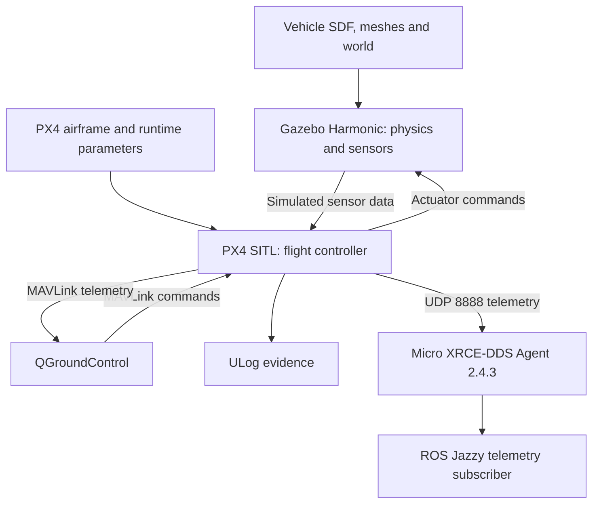
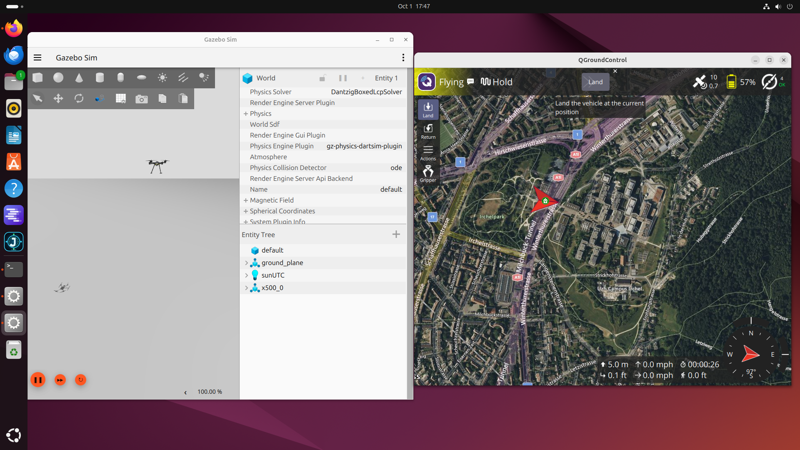

# Simulation environment and faculty questions 1–3

Updated October 3, 2026. Status: reference flight and ROS telemetry reception demonstrated; candidate-specific integration and complete reproducibility capture remain open.

Latest evidence: [October 3 daily checkpoint](iterations/2026-09-27/Daily_Log_2026-10-03.md) and [flight manifest](iterations/2026-09-27/Flight_Manifest_2026-10-03.json). October 1 observations below remain historical evidence.

## 1. Are we using Gazebo and SITL?

Yes. SITL means **software-in-the-loop**: the PX4 autopilot executes on the Linux workstation and exchanges simulated sensor and actuator data with Gazebo. QGroundControl provides the operator interface. This work exercises a reference vehicle; it does not yet simulate or validate the proposed DronePi aircraft, payload, electrical system or endurance.

The October 1 screenshot shows `x500_0` in the `default` world, with QGroundControl reporting Flying/Hold. The two archived ULogs identify PX4 commit `d6f12ad1c4f70ad3230afd7d86e971421e02fef4`, `SYS_AUTOSTART=4001`, and `MAV_TYPE=2`. The screenshot and logs are complementary evidence; an exact screenshot-to-log timestamp match has not been established.

## 2. Architecture, software and configuration

The diagram includes the October 3 ROS telemetry reception check. PX4 used agent endpoint 127.0.0.1:8888; QGroundControl used MAVLink UDP 18570 to remote 14550. ROS control commands, MAVROS, Point-LIO and the DronePi mission application have not been validated in this arrangement.

| Component | Recorded version or state | Evidence / limit |
|---|---|---|
| Workstation OS | Ubuntu 24.04.5 LTS, amd64-class Intel workstation | User terminal output October 2 |
| Python | 3.12.3 | User terminal output |
| GPU | NVIDIA RTX 5080, 16 GB class | October 1 nvidia-smi; driver 595.91.07 reported |
| PX4 | v1.17.0; commit d6f12ad1c4f70ad3230afd7d86e971421e02fef4 | User Git output and both ULogs |
| Gazebo | Native Harmonic, gz-sim 8.15.0 | User gz version output; distinct from installed Citadel Snap |
| QGroundControl | x86_64 AppImage; exact version and checksum pending | Startup screenshot; connected reference simulation screenshot |
| Vehicle / world | x500_0 / default | October 1 screenshot |
| ROS / colcon | Jazzy desktop 0.11.0-1noble.20260905.070740; ros-dev-tools 1.0.3; colcon on PATH | October 3 package output and talker/listener test |
| DDS Agent | v2.4.3; commit 73622810d984349b80bbac0ef55fc0b694d62222 | Successful workspace build and connected client |
| px4_msgs | v1.17.0; commit 86d8239e962f6939e05c3737784f60c02fa884db | Build transcript and decoded ROS telemetry |
| FreeCAD | Mechanical 0.22.0dev.34125, Snap 228 | CAD support tool, outside simulation control loop |
| DronePi code | Baseline 57d720586f81b035187e65cb0358b1f58233b36e; local repair c4813fa432162516f0fc36fc97caf44839198096 | 12 isolated regression checks pass; no full integration validation |

### Available evidence

- [Reference simulation screenshot](SITL_X500_2026-10-01.png).
- [Archived flight logs](iterations/2026-09-27/flight-logs/).
- [Initial parameter snapshots extracted from both logs](SITL_Parameters_2026-10-01.json). This contains initial P records, not a complete runtime history or a replacement for model/world configuration.
- [Verified repair checkpoint](iterations/2026-09-27/Repair_Checkpoint_2026-10-02.md).

### Reproduction status

The October 3 run explicitly used `make px4_sitl gz_x500` in the PX4 source directory. Startup output identifies `Tools/simulation/gz/worlds/default.sdf`, `x500_0`, Gazebo 8.15.0 and SYS_AUTOSTART=4001. The October 1 exact command remains unconfirmed. October 3 Git output shows a clean outer worktree and matching Gazebo submodule revision `b6127f4ec20de867e215fb5f78ae88b80f371909`. Full environment overrides and runtime parameter snapshot remain to be captured.

Expected source locations to verify in the user's pinned checkout:

- `ROMFS/px4fmu_common/init.d-posix/airframes/4001_gz_x500`
- `Tools/simulation/gz/models/x500/model.sdf`
- `Tools/simulation/gz/models/x500_base/model.sdf` and referenced meshes
- `Tools/simulation/gz/worlds/default.sdf`

The model repository/submodule commit is now recorded separately in the October 3 manifest. Do not assume the outer Git revision alone pins every local asset. The mass, inertia, rotor thrust/drag, sensor rates/noise, physics step, wind and payload settings have not yet been independently inventoried. No candidate-specific values should be filled in by assumption.

Before the next run, archive the exact command, software versions, submodule revisions, clean/dirty status, SDFs and dependencies, PX4 parameter export, environment overrides, mission file, expected result and acceptance criteria. Afterward add logs, screenshot, observed result, failures and shutdown state. Use a unique dated run ID.

## 3. Vehicle description and image

No custom URDF has been created or validated in the work documented so far. **URDF** means Unified Robot Description Format; **SDF** means Simulation Description Format. This PX4/Gazebo reference model uses SDF. A custom URDF is not a prerequisite for this reference test. We will create or adapt a candidate model only after dimensions, mass, inertia, propulsion and payload inputs are supported by documentation or measurement.

The reference UAV is the **X500 quadrotor**, a four-rotor multirotor, shown below. It is not evidence that the eventual DronePi build has been selected or modeled.

User-provided October 1 screenshot, used as project evidence. The map is the simulator's displayed context, not a Lead Mills field trial. World name `default` and entity `x500_0` are visible. A closer vehicle-only screenshot remains a useful follow-up.

## Sources and limitations

- [PX4 v1.17 Gazebo simulation](https://docs.px4.io/v1.17/en/sim_gazebo_gz/index)
- [PX4 v1.17 Gazebo vehicles](https://docs.px4.io/v1.17/en/sim_gazebo_gz/vehicles)
- [Original DronePi project](https://github.com/Xavier-Nieves/DronePi-Autonomous-Mapping)

Documentation establishes the upstream workflow; project claims above are tied separately to supplied terminal output, screenshot and logs. No full mission, mapping accuracy, physical-aircraft readiness or complete BOM validation is claimed here.

## October 3 result and limits

Alexander observed a steady 5-metre hover. PX4 reported takeoff, landing, automatic disarming and passing post-flight preflight checks. ROS decoded attitude, status, local position and landed state before flight. This was a QGroundControl-operated reference flight with the DDS agent running, not a DronePi-controlled mapping mission. Quantitative hover duration and accuracy have not been measured.

The pre-flight false heading_good_for_control flag was traced to isYawFinalAlignComplete() in the pinned source: magnetometer use requires in-flight magnetic alignment. Initial yaw alignment and magnetic heading consistency were true. Post-flight cs_mag_aligned_in_flight became true without a parameter bypass. The flag itself was not resampled after flight.

The closed 1,128,821,943-byte ULog remains on the workstation with a user-verified same-disk archive copy. Its checksum and source revisions are in the manifest; raw log analysis and a separate backup remain pending. The startup error for libGstCameraSystem.so remains open, and camera streaming/image capture is unverified.
